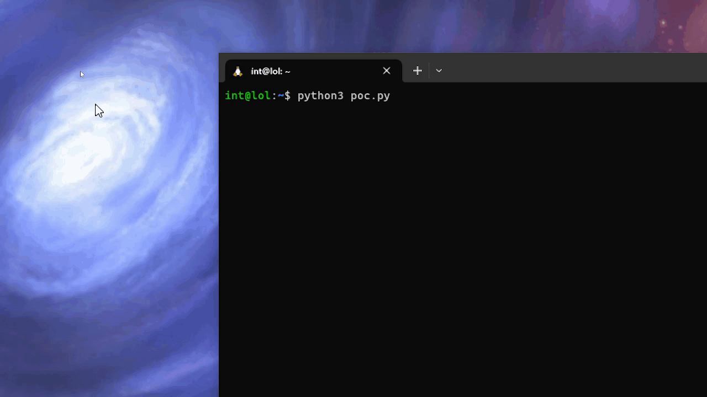

# Unique-ID-identifying-style

I've decided to create a exploit in Python programming language that is generating 10k numerical IDs, non-numerical IDs and uppercase and lowercase letters with digits together. Reason why I decided to create this is, it helped me in bug bounty on HackerOne. So, most of the time triagers will ask you how to identify low/high entropy ID if there's an IDOR bug or possible CSRF bug that requires ID in order to make it successful. 

**Note: This code that I have created, won't generate 10k valid IDs that exists on that program. There will be many positive and false positives.**

